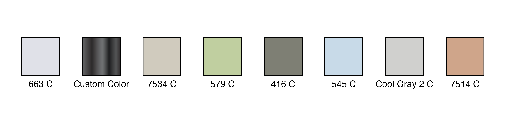

# Pantoner

## Description

This Adobe Illustrator script automates the process of generating color swatches from selected objects. 
It extracts all unique colors, creates swatch squares, and displays their corresponding Pantone codes (or custom color names) as editable text labels directly beneath each swatch. 
The script is designed to streamline color management, especially for designers working with manufacturers or clients who need clear, visual references for color specifications.
